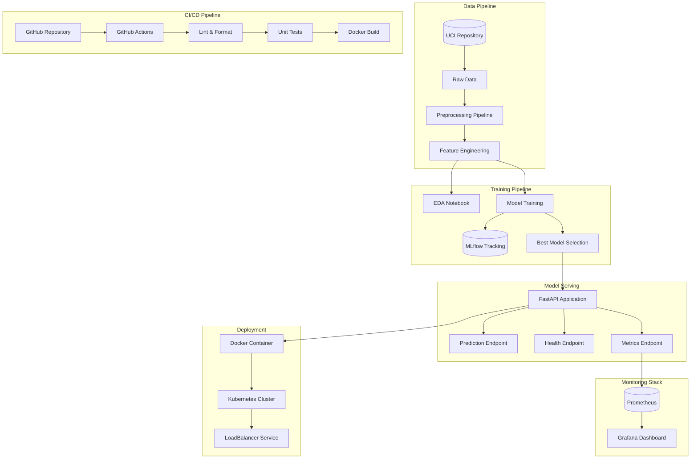
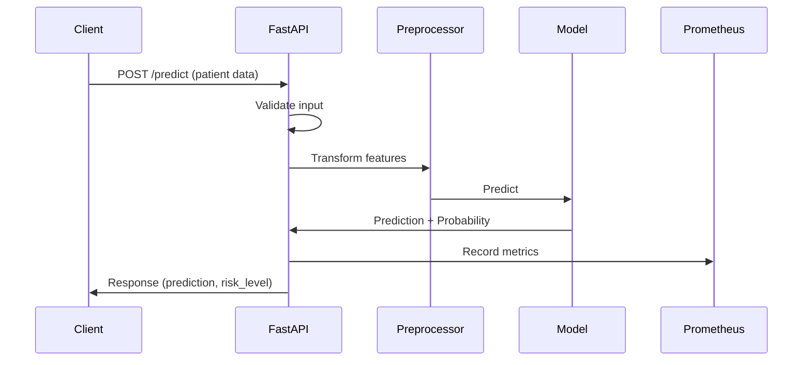

# Heart Disease Prediction - System Architecture

## High-Level Architecture

## Component Details

### 1. Data Pipeline
- **Data Source**: UCI Heart Disease Dataset (Cleveland)
- **Preprocessing**: Missing value handling, feature scaling, categorical encoding
- **Output**: Cleaned dataset ready for model training

### 2. Training Pipeline
- **EDA**: Comprehensive exploratory data analysis with visualizations
- **Models**: Logistic Regression, Random Forest, XGBoost
- **Tracking**: All experiments tracked in MLflow
- **Selection**: Best model selected based on ROC-AUC metric

### 3. Model Serving
- **FastAPI**: Modern, fast Python web framework
- **Endpoints**:
  - `/predict`: Make heart disease predictions
  - `/health`: API health check
  - `/metrics`: Prometheus metrics
- **Features**: Input validation, structured logging, error handling

### 4. Deployment
- **Docker**: Multi-stage build for optimized images
- **Kubernetes**: 
  - Deployment with 2 replicas
  - LoadBalancer service
  - Health probes (liveness/readiness)
  - Resource limits

### 5. Monitoring
- **Prometheus**: Metrics collection
- **Grafana**: Visualization dashboard
- **Metrics**:
  - Request rate
  - Latency percentiles
  - Prediction distribution

### 6. CI/CD Pipeline
- **Trigger**: Push/PR to main branch
- **Stages**:
  1. Lint (Black, Ruff)
  2. Test (pytest with coverage)
  3. Build (Docker image)
- **Artifacts**: Trained model, Docker image

## Data Flow

## Technology Stack

| Layer | Technology |
|-------|------------|
| Data Processing | pandas, scikit-learn |
| Machine Learning | scikit-learn, XGBoost |
| Experiment Tracking | MLflow |
| API Framework | FastAPI, Pydantic |
| Containerization | Docker |
| Orchestration | Kubernetes |
| Monitoring | Prometheus, Grafana |
| CI/CD | GitHub Actions |
| Testing | pytest, pytest-cov |
| Code Quality | Black, Ruff |

